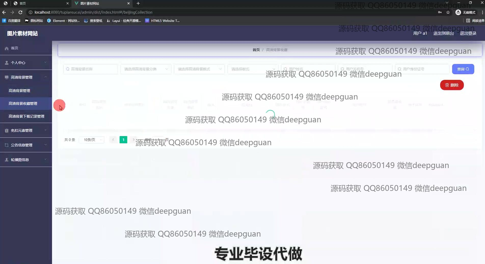

<h1 align="center">图片素材网站的设计与实现+vue</h1>

## 简介
图片素材网站平台：角色分为管理员、用户；实现图片浏览与下载、用户信息管理、素材上传与编辑、支付充值、权限设置等功能，采用SSM框架结合Vue技术，界面简洁，便于操作。    --计算机毕业设计源码；毕设源码；java毕业设计源码

## 联系方式

<h3 align="center">获取完整代码与数据库文件 + 微信：deepguan QQ: 86050149 QQ群: 783742310</h3>

<h3 align="center">可帮忙远程部署 包运行成功！提供远程部署、修改代码、设计文档指导、代码讲解等服务！</h3>

## 功能介绍（完整见运行截图）
管理员：管理员可以通过后台管理界面登录并管理网站资源，包括用户管理、分类管理、图片素材上传和编辑、公告管理等。可以进行用户信息的修改、搜索、新增、删除操作，管理图片素材的上传、分类、格式化及下载管理。此外，管理员可以浏览网站访问数据，管理轮播图和素材列表，提供高效的素材和用户信息管理。管理员有权限查看上传详情，维护素材的上下架状态，并可执行针对此信息的增删改查操作。

用户：用户通过前台界面登录，访问图片素材网站，享受包括导航栏功能、图片素材浏览和下载服务。用户可以查看素材的详细信息，如分类、格式、是否上线等，同时能够进行素材的预览及下载操作。用户有自己的个人信息管理界面，可以修改个人资料、上传头像、设置偏好以及查看收藏的素材。在界面上，用户能够通过搜索和过滤功能快速定位所需图片，并可选择素材进行收藏、删除等操作。

## 运行截图

本代码来源于网络,仅供学习参考使用!

